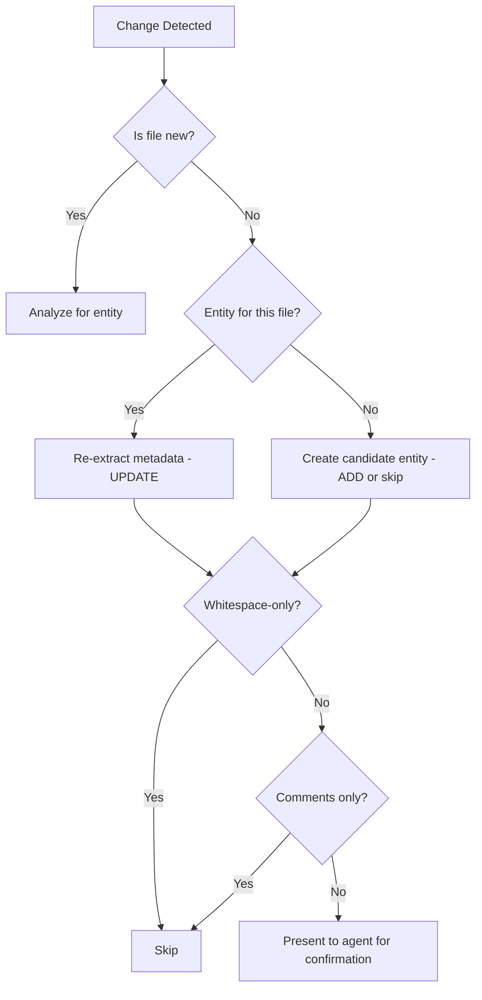

# Change Detection Helper

## Purpose

Detect non-trivial code changes and determine which operation to trigger: ADD, UPDATE, or DELETE.

## Operation Selection

| Scenario                       | Operation  | Rationale                     |
| ------------------------------ | ---------- | ----------------------------- |
| New file created               | **ADD**    | No entity exists yet          |
| New class/function in new file | **ADD**    | New code artifact to document |
| Entity doesn't exist           | **ADD**    | Create new node               |
| Entity exists, code changed    | **UPDATE** | Modify existing node          |
| Entity flagged `needs_update`  | **UPDATE** | Refresh stale content         |
| User says "update entity X"    | **UPDATE** | Explicit request              |
| Entity flagged `needs_delete`  | **DELETE** | Remove stale entity           |
| User says "delete entity X"    | **DELETE** | Explicit request              |

## Trivial vs Non-Trivial

### Trivial Changes (Skip All Operations)

| Change Type        | Detection                   | Example                                       |
| ------------------ | --------------------------- | --------------------------------------------- |
| Formatting         | Whitespace-only diff        | linter shows no semantic change               |
| Comments           | Only comment lines changed  | `# Added docstring`                           |
| Renaming local var | Single-file, limited scope  | `user_id = user_id_ref` → `uid = user_id_ref` |
| Version bump       | Only version number changed | `version = "1.0"` → `version = "1.1"`         |
| File renamed       | Same content, new path      | `auth.py` → `authentication.py`               |

### Non-Trivial Changes (Trigger Operation)

| Change Type                         | Detection                                                    | Operation                                               |
| ----------------------------------- | ------------------------------------------------------------ | ------------------------------------------------------- |
| New file created                    | Write tool on non-existent path                              | **ADD**                                                 |
| New class                           | Regex: `class \w+` in new content                            | **ADD** (if no entity) or **UPDATE** (if entity exists) |
| New function                        | Regex: `(def |async def |function )` in new content          | **ADD** or **UPDATE**                                   |
| New API endpoint                    | Regex: `@(get|post|put|delete|router)` decorators            | **ADD** or **UPDATE**                                   |
| Import changes                      | Diff: added/removed import statements                        | **UPDATE** (relationship change)                        |
| New dependency                      | `requirements.txt`, `pyproject.toml`, `package.json` changed | **ADD** or **UPDATE**                                   |
| Module structure change             | New exports in `__init__.py` or `index.ts`                   | **UPDATE**                                              |
| Entity implementation files changed | Files in entity's `implementation_files` modified            | **UPDATE**                                              |

## Detection Flow



## When to Use UPDATE

**UPDATE is triggered when:**

1. **Entity exists and code changed** — The file being modified already has a corresponding entity in the knowledge graph
2. **Implementation files modified** — Changes to files listed in entity's `implementation_files` field
3. **Import changes in existing entity** — New dependencies or removed dependencies in an entity's code
4. **User explicitly requests update** — "update entity X", "refresh entity X"
5. **Entity flagged as stale** — `needs_update: true` from health check

**UPDATE workflow:**

1. Check if entity exists for the file/module
2. Re-extract metadata from current code
3. Compare with existing entity content
4. Present diff (frontmatter changes, content changes)
5. Offer MERGE/OVERRIDE/CANCEL options

## When to Use ADD

**ADD is triggered when:**

1. **New file created** — No corresponding entity exists
2. **New entity candidate detected** — New class, function, or module with no existing entity
3. **User explicitly requests creation** — "remember this", "save to memory", "create entity"

**ADD workflow:**

1. Check if entity already exists
2. If exists → offer UPDATE instead
3. If not exists → extract metadata, present for confirmation

## When to Use DELETE

**DELETE is triggered when:**

1. **Entity flagged for deletion** — `needs_delete: true` from health check
2. **User explicitly requests deletion** — "delete entity X", "remove entity X"
3. **Implementation files no longer exist** — All files in `implementation_files` removed

**DELETE workflow:**

1. Show confirmation with affected related entities
2. Clean bidirectional references
3. Remove entity file

## Regex Patterns

### Python

```regex
# Class definition
class\s+\w+[:\(]

# Function definition
(async\s+)?def\s+\w+\s*\(

# API endpoint decorators (FastAPI, Flask)
@(get|post|put|delete|patch|router\.(get|post|put|delete|patch))\s*\(

# Import statements
^(import|from)\s+\w+
```

### JavaScript/TypeScript

```regex
# Class definition
class\s+\w+(\s+extends|\s+implements|\s*\{)

# Function definition
(function\s+\w+|(async\s+)?\w+\s*\([^)]*\)\s*(:\s*\w+)?\s*=>)

# Export statements
export\s+(default\s+)?(class|function|const|let|var)

# Import statements
import\s+.*\s+from\s+['"]
```

## Agent Confirmation Prompts

### For ADD

```
I detected a potential entity in your change:

**File:** {file_path}
**Type:** {detected_type}
**Name:** {extracted_name}

Should I create a knowledge graph entity for this?

[Yes — create entity]
[No — skip this time]
[Always skip for this file type]
```

### For UPDATE

```
Entity "{entity-name}" exists for this file. Changes detected:

**File:** {file_path}
**Changes:** {change_summary}

Should I update the entity?

[Yes — show diff]
[No — skip]
```

## Heuristic Tuning

### Confidence Levels

| Level  | Description                                          | Action                       |
| ------ | ---------------------------------------------------- | ---------------------------- |
| High   | New file with clear entity structure (class, module) | Auto-suggest entity creation |
| Medium | New function or method in existing file              | Ask if significant           |
| Low    | Import changes, small refactor                       | Log only, don't prompt       |

### Skip Patterns

Files matching these patterns are never analyzed:

- `*.test.py`, `*.spec.ts` — Test files
- `__pycache__/`, `.venv/`, `node_modules/` — Cache/modules
- `*.config.js`, `*.config.py` — Config files
- `README.md`, `CHANGELOG.md` — Documentation

## Implementation Notes

1. Use `Grep` with regex patterns for detection
2. Parse file content with `Read` for detailed analysis
3. Check entity existence before deciding ADD vs UPDATE
4. Keep heuristics conservative — better to miss than over-capture
5. Log all detections for debugging (don't prompt for low-confidence)

## When to Use RENAME

**RENAME is triggered when:**

1. **User explicitly requests rename** — "rename entity X to Y", "move entity X"
2. **File renamed with same content** — git shows `git mv` or content similarity >0.8
3. **Entity name is misleading** — rename for clarity

**RENAME vs DELETE+ADD:**

| Criterion             | Use RENAME | Use DELETE+ADD       |
| --------------------- | ---------- | -------------------- |
| Same entity, new name | ✓ Yes      | ✗ No (loses history) |
| Different entity      | ✗ No       | ✓ Yes                |
| Preserve usage        | ✓ Yes      | ✗ No                 |
| Preserve changelog    | ✓ Yes      | ✗ No                 |

**RENAME workflow:**

See [RENAME.md](../ops/RENAME.md)
