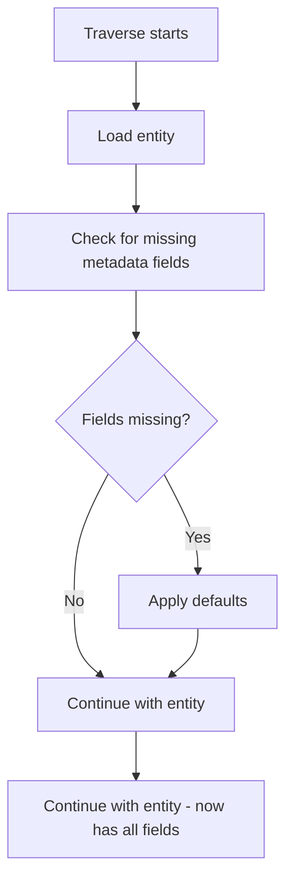
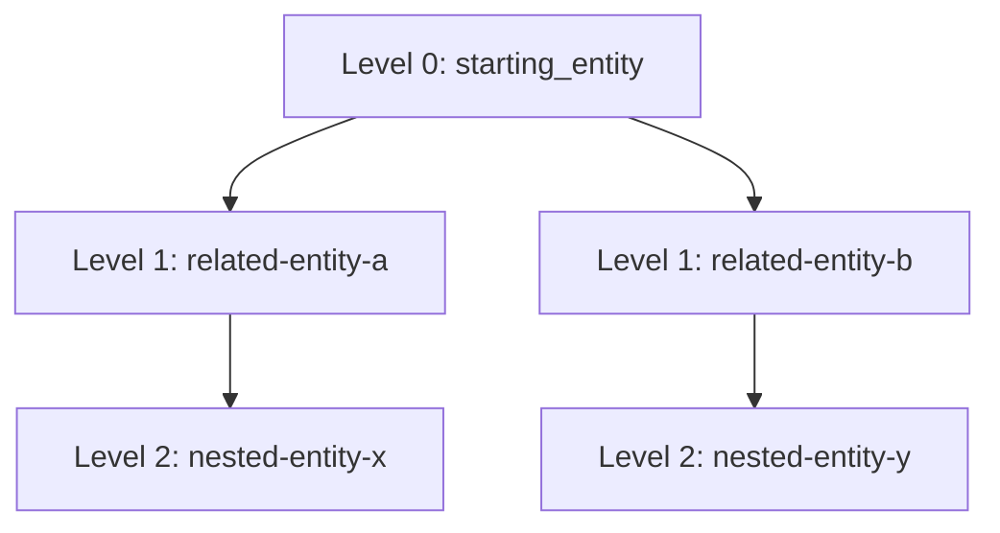

# Graph Traversal Helper

## Purpose

Traverse related entities via wiki-links to build context tree. Includes lazy migration for entities with old schema.

## Lazy Migration

When loading an entity, check for missing metadata fields and apply defaults.

### Migration Logic

```python
def migrate_entity(entity: Entity) -> Entity:
    """
    Apply lazy migration for entities with old schema.
    """
    today = current_date()

    # Migrate usage field
    if not hasattr(entity, 'usage') or entity.usage is None:
        entity.usage = {
            "last_used": today,
            "use_count": 1,
            "last_auto_query": None
        }

    # Migrate health field
    if not hasattr(entity, 'health') or entity.health is None:
        entity.health = {
            "stale_files": [],
            "last_verified": None,
            "needs_update": False,
            "needs_delete": False
        }

    return entity
```

### Migration on Load

```python
def load_entity(entity_path: str) -> Entity:
    """
    Load entity with lazy migration.
    """
    entity = read_entity(entity_path)
    entity = migrate_entity(entity)
    return entity
```

### Migration During Traversal

Entities are migrated as they are traversed. No batch migration needed.



## Traversal Algorithm

### Default Depth: 2 Levels



### Traversal Steps

1. **Load starting entity**: `Read("{graph_path}/entities/{name}.md")`
2. **Apply migration**: Check and fill missing fields
3. **Parse `related` field**: Extract wiki-links
4. **Load Level 1 entities**: Read each related entity, apply migration
5. **Parse Level 1 `related` fields**: Extract nested wiki-links
6. **Load Level 2 entities**: Read each nested entity, apply migration
7. **Stop at max depth**: Default 2, configurable

## Cycle Detection

Prevent infinite loops when entities reference each other:

```python
visited = set()
entities = []

def traverse(entity_name, depth, visited, entities):
    if depth > max_depth:
        return
    if entity_name in visited:
        return  # Cycle detected, skip
    visited.add(entity_name)
    entity = load_entity(entity_name)  # Includes migration
    entities.append(entity)
    for related in entity.related:
        traverse(related, depth + 1, visited, entities)
```

## Depth Control

| Depth | Use Case                    |
| ----- | --------------------------- |
| 1     | Direct dependencies only    |
| 2     | Default — immediate context |
| 3     | Broader architecture view   |
| 4+    | Full graph (expensive)      |

**User override:**

```
"Load context for auth-module with depth 3"
```

## Entity Priority

When presenting traversed entities, prioritize by:

| Priority | Criteria                               |
| -------- | -------------------------------------- |
| 1        | Starting entity (Level 0)              |
| 2        | Directly related (Level 1)             |
| 3        | Nested related (Level 2)               |
| 4        | Relevance score (computed)             |
| 5        | Importance field (high > medium > low) |

## Output Structure

```markdown
## Context Tree

**Root:** [[auth-module]] (Level 0)

### Level 1
- [[session-manager]] — Handles session lifecycle
- [[jwt-handler]] — Token creation/validation
- [[rate-limiter]] — Request throttling

### Level 2
- [[redis-cache]] — Session storage (via session-manager)
- [[token-pair]] — JWT payload structure (via jwt-handler)
```

## Traversal Implementation

### Parse Wiki-Links

From frontmatter `related` field:

```yaml
related:
  - "[[session-manager]]"
  - "[[jwt-handler]]"
```

Regex to extract:

```regex
\[\[([^\]]+)\]\]
```

### Load Entities with Migration

```python
def load_with_migration(entity_name: str) -> Entity:
    entity_path = f"{graph_path}/entities/{entity_name}.md"
    raw_content = Read(entity_path)

    # Parse frontmatter and content
    entity = parse_entity(raw_content)

    # Apply lazy migration
    entity = migrate_entity(entity)

    return entity
```

### Build Context Map

```json
{
  "auth-module": {
    "level": 0,
    "entity": { ... },
    "related": ["session-manager", "jwt-handler"]
  },
  "session-manager": {
    "level": 1,
    "entity": { ... },
    "related": ["redis-cache"]
  }
}
```

## Missing Entity Handling

When traversing to a wiki-link that doesn't exist:

```markdown
⚠ **Broken link:** [[missing-entity]] referenced from [[auth-module]]

Options:
- Create missing entity
- Remove broken link from source
- Continue without this entity
```

## Performance Considerations

| Graph Size           | Strategy                       |
| -------------------- | ------------------------------ |
| Small (<10 entities) | Load all at once               |
| Medium (10-50)       | Traverse on-demand             |
| Large (>50)          | Use targeted grep, limit depth |

**Lazy loading:** Only load full entity content when presenting constraints/patterns.

**Lazy migration:** Migrate entities as they are loaded, not in batch.

## Relevance Scoring Integration

After traversal, compute relevance scores for all loaded entities:

```python
def score_traversed_entities(entities: list[Entity]) -> list[Entity]:
    """
    Compute relevance scores for traversed entities.
    """
    max_use_count = max(e.usage.use_count for e in entities)
    for entity in entities:
        entity.relevance = compute_relevance(entity, max_use_count)
    return sorted(entities, key=lambda e: e.relevance, reverse=True)
```

See [relevance-scoring.md](./relevance-scoring.md) for computation details.

## Implementation Notes

1. Use `Read` to load entity documents
2. Parse YAML frontmatter with regex: `---\n([\s\S]*?)\n---`
3. Apply lazy migration to every loaded entity
4. Track visited entities in a set
5. Respect max_depth parameter
6. Compute relevance scores after traversal
7. Collect all constraints and patterns for presentation
