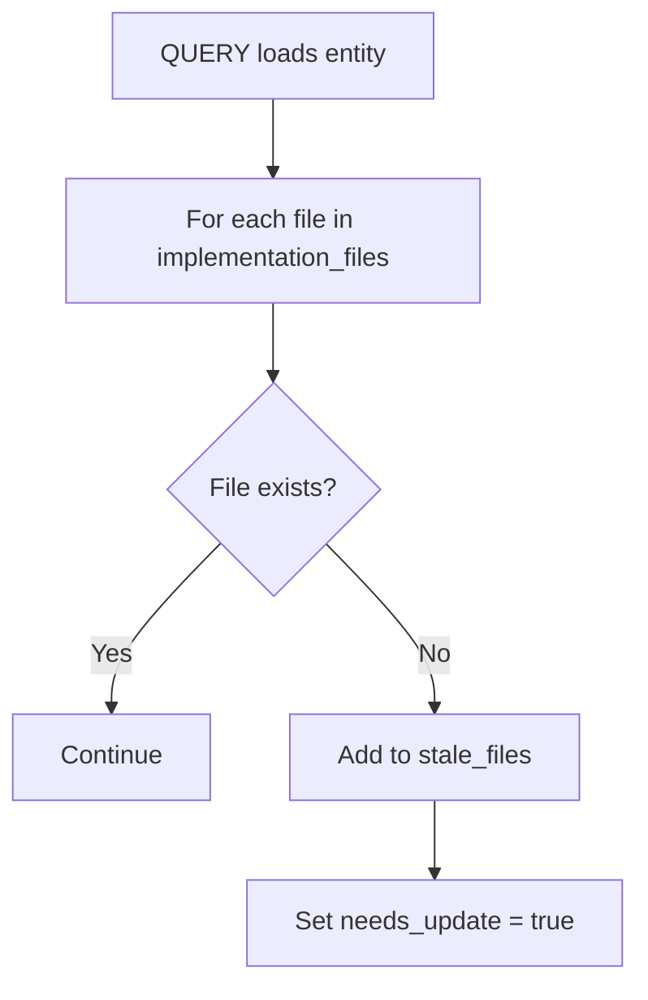
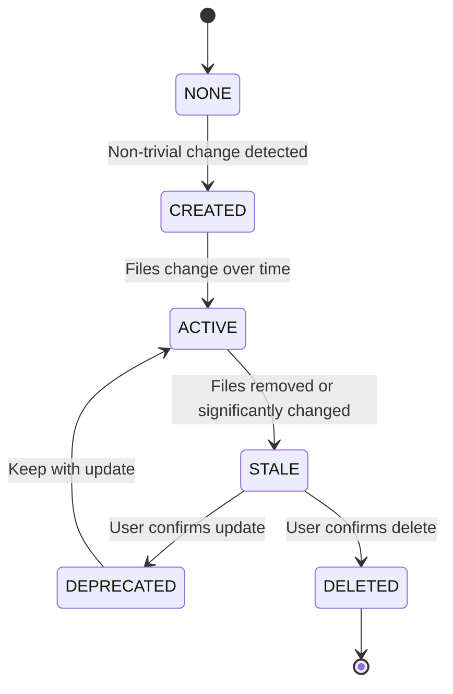

# Lifecycle Management Helper

## Purpose

Detect stale entities, track health status, and manage entity lifecycle (UPDATE/DELETE).

## Health Metadata Schema

```yaml
health:
  stale_files: [] # List of implementation files that no longer exist
  last_verified: null # Date of last health verification
  needs_update: false # Flag: entity content may be outdated
  needs_delete: false # Flag: entity should be considered for removal
```

## Stale Detection

### Detection Timing

Stale detection runs **on QUERY**, not continuously.

- **Lazy evaluation:** Only check entities being loaded
- **Non-blocking:** Flag issues but don't interrupt workflow
- **Actionable:** Surface in ADD/UPDATE/DELETE with concrete suggestions

### Detection Algorithm

```
For each entity loaded in QUERY:
    For each file in implementation_files:
        If not file.exists():
            Add file to health.stale_files
            Set health.needs_update = true
            Update health.last_verified = {today}
```

### Stale Detection Flow



### Example Output

```
⚠ **Stale Entity Detected**

Entity: [[inference-api.auth-service]]
Missing files:
 - `src/auth/legacy_handler.py` (deleted)
 - `src/utils/deprecated_util.py` (moved)

Options:
 [UPDATE] — Review and update entity
 [DELETE] — Remove entity
 [Dismiss] — Ignore for now
```

## Entity States



## UPDATE Flow

### Trigger

- Entity already exists during ADD operation
- User selects "UPDATE" from stale warning
- User manually requests update

### UPDATE Process

```
1. Load existing entity
2. Extract new metadata from current code
3. Show diff between old and new:
   - Frontmatter changes
   - Content changes
   - Trigger pattern changes
4. Prompt for confirmation:
   [MERGE] — Keep both, prefer new
   [OVERRIDE] — Replace all with new
   [CANCEL] — Keep existing
5. On confirmation:
   - Update entity document
   - Increment changelog version
   - Clear health.stale_files
   - Set health.needs_update = false
   - Update `updated` date
```

### Diff Format

```
### Entity Update: inference-api.auth-service

**Changes detected:**

#### Frontmatter
- `importance`: high → medium
- `tags`: [+rate-limit] [-legacy-auth]

#### Content
- Description: 2 lines changed
- Agent Context: triggers updated

#### Health
- Stale files: 2 cleared

[MERGE] [OVERRIDE] [CANCEL]
```

## DELETE Flow

### Trigger

- User selects "DELETE" from stale warning
- User manually requests deletion
- Entity flagged with `needs_delete = true`

### DELETE Process

```
1. Show confirmation prompt:
   "Delete 'inference-api.auth-service'?"
   "This will remove the entity and its bidirectional references."

2. On confirmation:
   a. Load entity to get related entities
   b. For each related entity:
      - Remove wiki-link to deleted entity
      - Update related entity file
   c. Delete entity file
   d. Report results
```

### Confirmation Prompt

```
### Delete Entity: inference-api.auth-service

**Warning:** This action cannot be undone.

Entity will be removed along with:
 - Bidirectional reference from [[inference-api.session-manager]]
 - Bidirectional reference from [[inference-api.jwt-handler]]

[Confirm] [Cancel]
```

### Result Report

```
### DELETE Complete

**Deleted:** inference-api.auth-service
**File removed:** `memory/project/entities/inference-api.auth-service.md`

**References cleaned:**
 - [[inference-api.session-manager]] — removed reference
 - [[inference-api.jwt-handler]] — removed reference

**Orphaned entities:** None
```

## Health Check Command

### Trigger

- User says "check knowledge graph health" or similar
- Periodic reminder (optional, configurable)

### Health Check Process

```
1. Scan all entity files in {graph_path}/entities/
2. For each entity:
   a. Check implementation files existence
   b. Check usage.last_used for staleness
   c. Check health flags (needs_update, needs_delete)
3. Aggregate results
4. Present findings with batch operations
```

### Health Check Output

```
### Health Check Results

**Total entities:** 45
**Healthy:** 38
**Issues found:** 7

#### Entities Needing Attention

| Entity                           | Issue       | Details                 |
| -------------------------------- | ----------- | ----------------------- |
| [[inference-api.auth-service]]   | Stale files | 2 files missing         |
| [[inference-api.old-module]]     | Unused      | Not used in 45 days     |
| [[inference-api.deprecated-api]] | Flagged     | needs_delete = true     |
| [[inference-api.payment-v1]]     | Deprecated  | status = deprecated     |
| [[inference-api.legacy-handler]] | Stale       | Not verified in 60 days |

#### Batch Operations
[Review Each] [Batch Update Stale] [Batch Delete Unused] [Dismiss]
```

## Stale Thresholds

| Threshold | Days  | Action                  |
| --------- | ----- | ----------------------- |
| Recent    | 0-30  | Normal use              |
| Aging     | 31-60 | Monitor, no warning     |
| Stale     | 61-90 | Suggest verification    |
| Unused    | 90+   | Flag for cleanup review |

## Integration Points

### QUERY Operation

After loading entities:

```python
for entity in loaded_entities:
    health_check = check_entity_health(entity)
    if health_check.stale_files:
        present_stale_warning(entity, health_check)
    if health_check.needs_delete:
        suggest_deletion(entity)
```

### ADD/UPDATE/DELETE Operations

Before creating entity:

```python
if entity_exists(entity_name):
    offer_update_or_delete(entity_name, existing_entity, new_content)
```

### Session Start

Optional health summary:

```python
if config.show_health_summary:
    issues = quick_health_scan()
    if issues:
        present_summary(issues)
```

## Configuration

| Parameter               | Default | Description                          |
| ----------------------- | ------- | ------------------------------------ |
| `stale_days_threshold`  | 30      | Days before suggesting verification  |
| `unused_days_threshold` | 90      | Days before flagging for cleanup     |
| `verify_on_query`       | true    | Check health when entity is loaded   |
| `batch_size`            | 10      | Max entities to show in health check |

## Bases Integration

### Computed Lifecycle State

The `{project}.graph.base` dashboard computes entity lifecycle state dynamically using the `lifecycle_state` formula:

```yaml
lifecycle_state: |
  if(health.needs_delete, "DEPRECATED",
    if(health.needs_update || health.stale_files.length > 0, "STALE",
      if(!usage.last_used || usage.use_count == 0, "CREATED",
        if((now() - date(usage.last_used)).days > 90, "STALE", "ACTIVE"))))
```

### State Transitions

| State      | Entry Condition                                       | Exit Condition           | Action in Bases                 |
| ---------- | ----------------------------------------------------- | ------------------------ | ------------------------------- |
| NONE       | New entity                                            | Always passes to CREATED | (Internal, not displayed)       |
| CREATED    | Entity exists, never used                             | First QUERY or UPDATE    | Show as "New"                   |
| ACTIVE     | Recently used (within 90 days)                        | 90+ days unused          | Show as "Active"                |
| STALE      | Files missing OR needs_update flag OR 90+ days unused | User verifies entity     | Show "🔄 Update" or "⏰ Verify" |
| DEPRECATED | needs_delete flag set                                 | Entity deleted           | Show "⚠️ Delete"                |
| DELETED    | Entity file removed                                   | —                        | Removed from base               |

## Bulk Sync (Multiple Entities)

Use when multiple entities need update/delete from a single refactor event (file consolidations, renames, deletions across the codebase).

### When to Use Bulk Sync

- Multiple files consolidated into one (e.g., 4 daemon sub-modules merged into `daemon.py`)
- Several implementation files renamed or moved
- Group of entities with stale implementation files from the same refactor
- After running SYNC operation and reviewing the diff report

### Bulk Sync Process

```
1. Identify affected entities from SYNC diff report or manual audit
2. Group changes by operation type:
   a. UPDATE — entities whose implementation_files changed
   b. DELETE — entities whose implementation files are gone and not replaced
   c. RENAME — entities whose name or implementation_file path changed
3. Process each group:
   For each UPDATE:
     - Re-extract metadata from current code
     - Merge new implementation_files, lines, description
     - Update bidirectional references if relations changed
     - Increment changelog
   For each DELETE:
     - Confirm deletion
     - Clean bidirectional references from related entities
     - Delete entity file
     - Check for orphans
   For each RENAME:
     - Move entity file to new name
     - Update all backlinks across the graph to point to new name
     - Preserve changelog history
4. Verify graph integrity (run VERIFY operation)
```

### Consolidation Pattern

When multiple source files are merged into one (the most common bulk-sync scenario):

#### Old State

| Entity                 | Implementation Files                      |
| ---------------------- | ----------------------------------------- |
| acp.daemon-state       | `modules/daemon_state.py` (200 lines)     |
| acp.daemon-lifecycle   | `modules/daemon_lifecycle.py` (150 lines) |
| acp.daemon-session     | `modules/daemon_session.py` (180 lines)   |
| acp.daemon             | `modules/daemon.py` (23 lines, facade)    |

#### New State

| Entity                 | Change                                                                     |
| ---------------------- | -------------------------------------------------------------------------- |
| acp.daemon             | UPDATE: `implementation_files = ["modules/daemon.py"]`, lines 23 → 641     |
| acp.daemon-state       | DELETE: all files gone                                                     |
| acp.daemon-lifecycle   | DELETE: all files gone                                                     |
| acp.daemon-session     | DELETE: all files gone                                                     |

#### Steps

1. **Prepare:**
   - Identify the surviving entity (the one whose file absorbed the others)
   - Identify entities to delete (their files no longer exist)

2. **Update surviving entity:**
   - Update `implementation_files` to the consolidated file path
   - Update `lines` to the new line count
   - Re-extract description, imports, exports from consolidated code
   - Add changelog entry: `"Consolidated from {n} files into modules/daemon.py"`
   - Check if new imports/exports require new relationships

3. **Delete consumed entities:**
   - For each entity to delete:
     - Remove its `[[{project}.{entity-name}]]` references from all related entities' `related` fields
     - Delete its entity file
   - Check if any remaining entity has empty `related` after cleanup

4. **Fix re-routed references:**
   - In surviving entity, ensure it now references entities that the consumed entities previously referenced (if the consolidated code still touches them)
   - Update any remaining wiki-links in body text that point to now-deleted entities — either remove or redirect

5. **Fix body references:**
   - In all non-deleted entities, find body references `[[{project}.deleted-entity]]` and decide: remove or redirect

6. **Verify:**
   - All wiki-links resolve
   - All backlinks are bidirectional
   - No stale implementation files remain

### Rename Pattern

When a single file is renamed:

| Old File                        | New File                 | Change       |
| ------------------------------- | ------------------------ | ------------ |
| `modules/daemon_permissions.py` | `modules/permissions.py` | File renamed |

#### Steps

1. **Rename entity:** Use RENAME operation to move the entity file
2. **Update implementation_file:** Update path in renamed entity
3. **Update backlinks:** Update all `[[{project}.old-name]]` references across the graph to `[[{project}.new-name]]`
4. **Verify:** All links resolve, backlinks are bidirectional

## Best Practices

1. **Don't auto-delete:** Always require user confirmation
2. **Preserve references:** Clean bidirectional links on DELETE
3. **Lazy evaluation:** Only check health when needed
4. **Clear warnings:** Show exactly what's wrong and how to fix it
5. **Batch operations:** Allow bulk updates for efficiency
6. **Process consolidations before renames:** If multiple files merge into one, do the consolidations first, then handle any renamed surviving files
7. **Run VERIFY after every bulk sync:** The more entities you touch, the higher the chance of introducing inconsistencies
