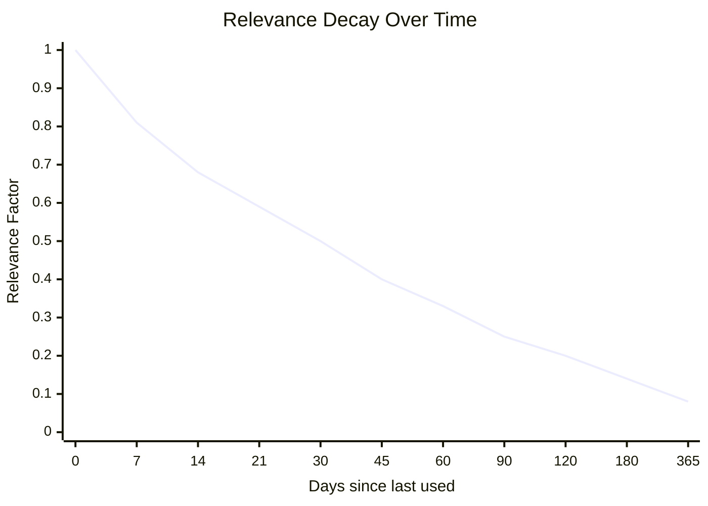

# Relevance Scoring Helper

## Purpose

Compute relevance scores for entities to prioritize context loading and retrieval.

## Formula

```
relevance = importance_weight × recency_factor × usage_factor

where:
  recency_factor = 1 / (1 + days_since_last_used / 30)
  usage_factor = log(use_count + 1) / log(max_use_count + 1)
```

## Components

### Importance Weight

Maps entity importance level to a weight multiplier.

| Importance | Weight |
| ---------- | ------ |
| high       | 1.0    |
| medium     | 0.7    |
| low        | 0.4    |

**Rationale:** High-importance entities (core business logic, auth, payment) should always rank higher, all else equal.

### Recency Factor

Decays relevance for entities not recently used.

```
recency_factor = 1 / (1 + days_since_last_used / 30)
```

- Range: ~1.0 (used today) to approaching 0 (unused for a long time)
- Half-life of 30 days (entity used 30 days ago has factor ≈ 0.67)

**Decay curve:**



### Usage Factor

Rewards frequently used entities with logarithmic scaling to prevent gaming.

```
usage_factor = log(use_count + 1) / log(max_use_count + 1)
```

- Range: 0.0 (never used) to 1.0 (most-used entity)
- Logarithmic scaling provides diminishing returns
- `max_use_count` is the highest use_count across all entities (dynamic)

**Example (max_use_count = 100):**

| Entity | use_count | usage_factor            |
| ------ | --------- | ----------------------- |
| A      | 80        | log(81)/log(101) = 0.96 |
| B      | 10        | log(11)/log(101) = 0.52 |
| C      | 1         | log(2)/log(101) = 0.15  |

## Computation Steps

### Step 1: Gather Entity Metadata

```yaml
importance: high
usage:
  last_used: 2026-04-01
  use_count: 15
```

### Step 2: Compute Components

```
importance_weight = 1.0 (high)
days_since = 5 (assuming today is 2026-04-06)
recency_factor = 1 / (1 + 5/30) = 0.86
usage_factor = log(16) / log(51) = 0.71 (assuming max_use_count = 50)
```

### Step 3: Compute Final Score

```
relevance = 1.0 × 0.86 × 0.71 = 0.61
```

## Implementation

### Pseudo-code

```python
def compute_relevance(entity, max_use_count, today):
    # Importance weight
    importance_weights = {"high": 1.0, "medium": 0.7, "low": 0.4}
    importance_weight = importance_weights.get(entity.importance, 0.5)

    # Recency factor
    days_since = (today - entity.usage.last_used).days
    recency_factor = 1 / (1 + days_since / 30)

    # Usage factor
    import math
    usage_factor = math.log(entity.usage.use_count + 1) / math.log(max_use_count + 1)

    return importance_weight * recency_factor * usage_factor
```

### Sorting

When sorting entities for retrieval:

```python
entities.sort(key=lambda e: compute_relevance(e, max_use_count, today), reverse=True)
```

## Edge Cases

| Case                                 | Handling                                     |
| ------------------------------------ | -------------------------------------------- |
| Entity never used                    | usage_factor = log(1)/log(max+1) ≈ 0         |
| max_use_count = 0 (no entities used) | Set max_use_count = 1 to avoid log(1)/log(1) |
| last_used in future                  | Clamp days_since to 0                        |

## Integration Points

### QUERY Operation

1. Load all matching entities
2. Compute relevance for each
3. Sort by relevance (descending)
4. Apply token budget (high-relevance first)

### Auto-Query

1. Detect context, retrieve candidates
2. Compute relevance for each
3. Load top-K within budget

### Health Check

1. Report entities with low relevance (< 0.1)
2. Suggest cleanup for long-unused entities

## Configuration

| Parameter                 | Default | Description                                   |
| ------------------------- | ------- | --------------------------------------------- |
| `decay_half_life`         | 30      | Days for recency factor to decay to ~0.67     |
| `min_relevance_threshold` | 0.05    | Below this, entity may be flagged for cleanup |
| `max_use_count_refresh`   | session | When to recalculate max_use_count             |

## Notes

- Scores are computed on-demand, not stored (metadata is source of truth)
- max_use_count should be recalculated when scoring a batch of entities
- Consider caching scores if computation becomes expensive
