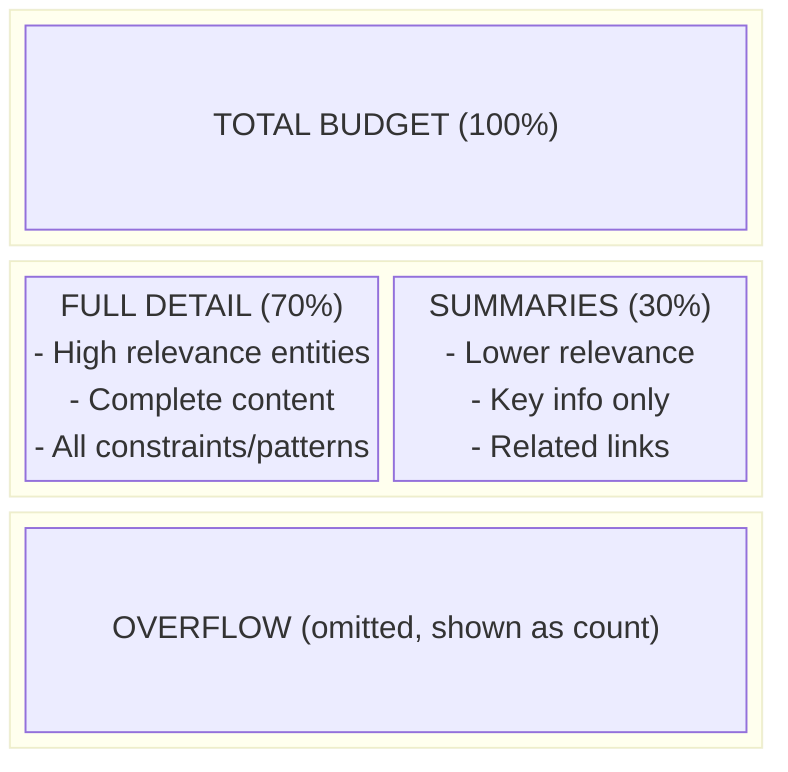

# Token Budget Helper

## Purpose

Manage context size by counting tokens and enforcing budget limits during QUERY operations.

## Token Budget Strategy

**Decision:** Hard budget with prioritized compression.

```
1. Load all matching entities
2. Compute relevance scores
3. Sort by relevance (descending)
4. Fill budget with:
   - Top 70% budget: Full detail entities
   - Remaining 30% budget: Summarized entities
   - Overflow: Omitted with count
```

## Default Budget

| Context        | Default Budget | Rationale                         |
| -------------- | -------------- | --------------------------------- |
| Auto-query     | 4000 tokens    | Enough for 8-10 entities in full  |
| Manual QUERY   | 6000 tokens    | User explicitly requested context |
| Deep traversal | 8000 tokens    | User requested depth > 2          |

**User override:**

```
"Load context for auth-module with budget 10000"
```

## Token Counting

### Estimation Method

Use character-based estimation (no external tokenizer needed):

```
tokens ≈ characters / 4

where:
  - English text: ~4 characters per token
  - Code: ~3 characters per token (more symbols)
  - Mixed content: ~3.5 characters per token
```

### Counting Algorithm

```python
def count_tokens(content: str, content_type: str = "mixed") -> int:
    ratios = {
        "english": 4,
        "code": 3,
        "mixed": 3.5
    }
    ratio = ratios.get(content_type, 3.5)
    return len(content) // ratio
```

**Calibration Note:** The ratios are estimates. Calibrate with tiktoken: `len(text) / len(tiktoken.encode(text))`. Adjust ratios dict if systematically off.

### Entity Token Count

```python
def count_entity_tokens(entity: Entity) -> int:
    # Count frontmatter
    frontmatter_tokens = count_tokens(entity.frontmatter, "mixed")

    # Count content
    content_tokens = count_tokens(entity.content, "mixed")

    # Count agent-context block
    if entity.agent_context:
        ac_tokens = count_tokens(entity.agent_context, "code")
    else:
        ac_tokens = 0

    return frontmatter_tokens + content_tokens + ac_tokens
```

## Budget Enforcement

### Algorithm

```python
def enforce_budget(entities: list[Entity], budget: int) -> tuple[list, list, list]:
    """
    Returns: (full_detail, summarized, omitted)
    """
    # Sort by relevance
    sorted_entities = sorted(entities, key=lambda e: e.relevance, reverse=True)

    full_detail = []
    summarized = []
    omitted = []

    full_budget = int(budget * 0.7)
    summary_budget = int(budget * 0.3)
    used_tokens = 0

    # Fill full detail (70%)
    for entity in sorted_entities:
        entity_tokens = count_entity_tokens(entity)
        if used_tokens + entity_tokens <= full_budget:
            full_detail.append(entity)
            used_tokens += entity_tokens
        else:
            # Try to fit in summary budget
            summary_tokens = count_summary_tokens(entity)
            if used_tokens + summary_tokens <= budget:
                summarized.append(entity)
                used_tokens += summary_tokens
            else:
                omitted.append(entity)

    return full_detail, summarized, omitted
```

### Token Distribution



## Entity Summarization

### Summary Format

For entities that don't fit in full detail:

```markdown
#### [[{entity-name}]] (relevance: {score}) — *Summary*

- Type: {type} ({category})
- Key constraint: {most_important_constraint}
- Related: [[{related-1}]],[[related-2}]]
- Implementation: `{primary_file}`
```

### Summary Token Count

Summary is approximately 20% of full entity:

```python
def count_summary_tokens(entity: Entity) -> int:
    # Summary is ~100-150 tokens
    return 150  # Fixed estimate
```

## Tiered Compression

**Four compression levels for better budget utilization:**

| Tier           | Size | Content                           |
| -------------- | ---- | --------------------------------- |
| **Full**       | 100% | Complete entity with all sections |
| **Mini**       | 50%  | Key sections only                 |
| **Micro**      | 20%  | One-liner summary                 |
| **Title-only** | ~5%  | Name + type + relevance           |

### Most Important Constraint Selection

```python
def get_most_important_constraint(entity: Entity) -> str:
    if not entity.constraints:
        return "None"

    # Prefer constraints with keywords: MUST, NEVER, ALWAYS, REQUIRED
    priority_keywords = ["MUST", "NEVER", "ALWAYS", "REQUIRED"]
    for constraint in entity.constraints:
        for keyword in priority_keywords:
            if keyword in constraint.upper():
                return constraint

    # Fall back to first constraint
    return entity.constraints[0]
```

## Compression Notice

### Output Format

When budget is exceeded:

```markdown
### Context Briefing

**Loaded:** 8 entities (4500 tokens)
**Budget:** 4000 tokens

**Compression applied:**
- Full detail: 5 entities (2800 tokens)
- Summarized: 3 entities (600 tokens)
- Omitted: 2 entities

---

{context for each entity}

---

*{omitted_count} lower-relevance entities omitted. Use "load full context for {entity-name}" to see specific entities.*
```

### User Request for Full Context

If user requests full context for a specific entity:

```
"Load full context for auth-service"
```

Load the entity in full detail, even if previously summarized or omitted.

## Budget Override

### User-Specified Budget

```
"Load context for auth-module with budget 10000"
```

Use the specified budget instead of default.

### No Budget (Load All)

```
"Load full context for auth-module"
```

Load all entities without budget limit. Warn if total exceeds 15000 tokens.

### Budget Warnings

| Total Tokens | Action                    |
| ------------ | ------------------------- |
| < 4000       | Normal load               |
| 4000-8000    | Apply budget              |
| 8000-15000   | Warn about large context  |
| > 15000      | Require explicit override |

## Integration Points

### QUERY Operation

After finding and scoring entities:

```python
# Step 1: Count total tokens
total_tokens = sum(count_entity_tokens(e) for e in entities)

# Step 2: Compare to budget
if total_tokens > budget:
    # Step 3: Apply compression
    full, summarized, omitted = enforce_budget(entities, budget)

    # Step 4: Present with compression notice
    present_with_compression(full, summarized, omitted)
else:
    # No compression needed
    present_all(entities)
```

### Auto-Query

Auto-query uses a conservative budget (4000 tokens) to avoid overwhelming the context at session start.

### Deep Traversal

For depth > 2, increase budget to account for more entities:

```python
budget = base_budget + (depth - 2) * 1000
```

## Configuration

| Parameter                | Default | Description                          |
| ------------------------ | ------- | ------------------------------------ |
| `default_budget`         | 4000    | Standard token budget                |
| `auto_query_budget`      | 4000    | Budget for auto-query                |
| `full_detail_ratio`      | 0.7     | Fraction of budget for full detail   |
| `summary_token_estimate` | 150     | Tokens per summarized entity         |
| `warning_threshold`      | 8000    | Warn above this threshold            |
| `max_without_override`   | 15000   | Require explicit override above this |

## Best Practices

1. **Count before loading:** Estimate tokens to avoid overflow
2. **Prioritize by relevance:** High-relevance entities get full detail
3. **Preserve key info:** Summaries keep most important constraint
4. **Be transparent:** Show compression details to user
5. **Allow override:** User can request full context for specific entities
6. **Warn on large contexts:** Don't silently load 20000+ tokens
