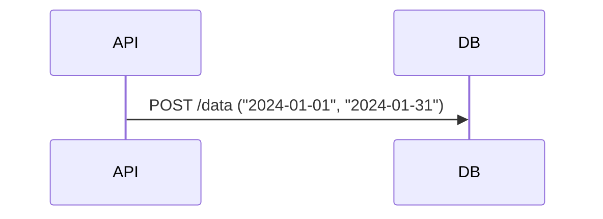
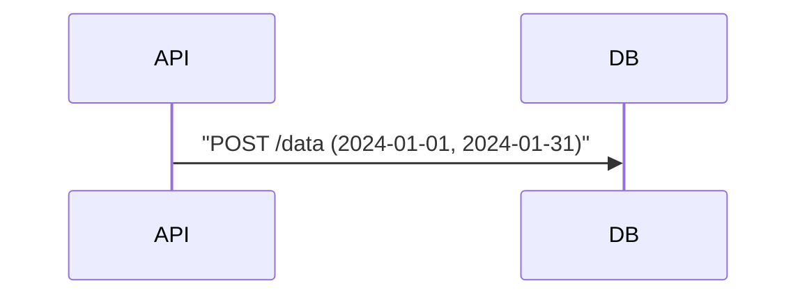

# Mermaid Syntax Validation Helpers

## Purpose

Prevent common Mermaid parsing errors before output. Use these rules when generating any Mermaid diagram.

## Critical Syntax Rules

### Rule 1: Avoid List Syntax Conflicts

Markdown parsers interpret `[1. Item]` as a numbered list, causing "Unsupported markdown: list" errors.

**Transformations:**

| Input             | Valid Output                               |
| ----------------- | ------------------------------------------ |
| `[1. Perception]` | `[1.Perception]` (remove space)            |
| `[1. Perception]` | `["(1) Perception"]` (use parentheses)     |
| `[1. Perception]` | `[① Perception]` (use circled numbers)     |
| `[1. Perception]` | `[Step 1: Perception]` (use "Step" prefix) |

**Regex pattern to detect:** `\[\d+\.\s` (numbered item with space after period)

### Rule 2: Subgraph Naming

Subgraphs with display names containing spaces must use the ID format.

**Format:** `subgraph id["Display Name"]`

| Input                      | Valid Output                                    |
| -------------------------- | ----------------------------------------------- |
| `subgraph AI Agent Core`   | `subgraph agent["AI Agent Core"]`               |
| `subgraph Knowledge Graph` | `subgraph kg["Knowledge Graph"]`                |
| `subgraph entity`          | `subgraph entity` (simple ID, no quotes needed) |

**Rule:** Always reference subgraph by ID, not display name.

### Rule 3: Node References

When connecting nodes, use the node ID, not the display text.

| Invalid                   | Valid             |
| ------------------------- | ----------------- |
| `Title --> AI Agent Core` | `Title --> agent` |
| `Start --> Process Input` | `Start --> input` |

### Rule 4: Special Characters in Node Text

Avoid problematic characters in node text:

| Character                | Replace With                 |
| ------------------------ | ---------------------------- |
| `"` (quotation marks)    | `“”` (smart quotes)          |
| `(` `)` (parentheses)    | `「」` (lenticular brackets) |
| `[` `]` (sqare brackets) | `「」` (lenticular brackets) |
| Emoji                    | Text labels or color coding  |

**Line breaks:** Only valid in circle nodes: `((Line 1<br/>Line 2))`

### Rule 5: Arrow Types

Use correct arrow syntax:

| Arrow  | Meaning                            |
| ------ | ---------------------------------- |
| `-->`  | Solid arrow (direct connection)    |
| `-.->` | Dashed arrow (supporting/optional) |
| `==>`  | Thick arrow (emphasis)             |
| `~~~`  | Invisible link (layout only)       |

## Validation Checklist

Before outputting any Mermaid diagram, verify:

- [ ] No "number. space" patterns (`[1. Item]`)
- [ ] All subgraphs use proper ID format
- [ ] All arrows use correct syntax
- [ ] Colors applied consistently (if styled)
- [ ] Layout direction specified (TB, LR, RL, BT)
- [ ] No emoji in any node text
- [ ] No ambiguous node references
- [ ] Compatible with Obsidian and GitHub renderers

## Pre-Output Validation Function

```
function validateMermaid(code):
  errors = []

  # Check for list syntax conflicts
  if regex.match(code, r'\[\d+\.\s'):
    errors.append("List syntax conflict: use [N.Item] or [(N) Item]")

  # Check for unquoted subgraph names with spaces
  if regex.match(code, r'subgraph\s+\w+\s+\w+'):
    errors.append("Subgraph name with space needs quotes")

  # Check for emoji
  if contains_emoji(code):
    errors.append("Remove emoji from node text")

  # Check for invalid arrows
  if regex.match(code, r'[^-]-[^->]'):
    errors.append("Invalid arrow syntax")

  return errors
```

## Common Error Messages

| Error                        | Cause                           | Fix                       |
| ---------------------------- | ------------------------------- | ------------------------- |
| "Unsupported markdown: list" | `[1. Item]` syntax              | Use `[1.Item]`            |
| "Expecting 'SUBGRAPH'"       | Missing quotes in subgraph name | Use `subgraph id["Name"]` |
| "Unknown node reference"     | Referencing display name        | Use node ID               |

### Rule 6: Missing Participant Keyword

In sequence diagrams, every participant declaration MUST start with `participant` or `actor`.

**Invalid:**

```
    API as MOEPP API  # WRONG!
    DB as DuckDB      # WRONG!
```

**Valid:**

```
    participant API as MOEPP API
    participant DB as DuckDB
```

**Detection:** Lines with ` as ` that don't start with `participant`, `actor`, or message arrows.

### Rule 7: Commas in Message Content

Sequence diagram messages with commas or unescaped quotes will fail to parse.

**Problem:**



**Fix:** Wrap message in quotes or escape commas:



**Detection:** Messages containing `,` `;` `(` `)` should be wrapped in quotes.

**Code fix:**

```python
def sanitize_message(msg: str) -> str:
    if any(c in msg for c in [',', ';', '(', ')', '[', ']']):
        return f'"{msg}"'
    return msg
```

### Rule 8: JSON Escaping in .base Files

When generating `.base` files (Obsidian Bases) from templates, ensure
property values with quotes are properly escaped.

**Problem:** `content: "Type: {{type}}"` in JSON:

If `{{type}}` renders to a value containing `"`, the JSON becomes invalid.

**Fix:** Template engines should escape quotes:

```json
{
  "card": {
    "content": "**Type:** {{type|escape}}"
  }
}
```

**Or use single quotes in YAML template:**

```yaml
content: '**Type:** {{type}}'
```

**Detection:** Parser errors like "Missing closing quote"
