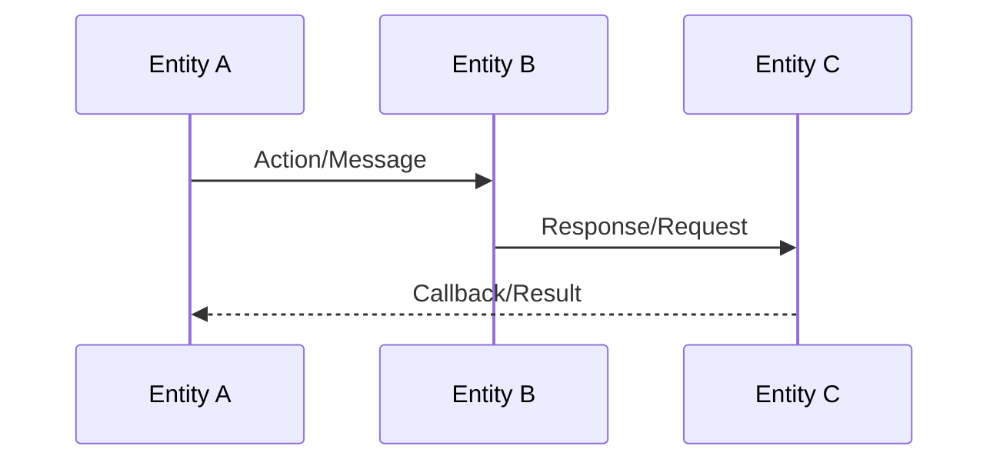
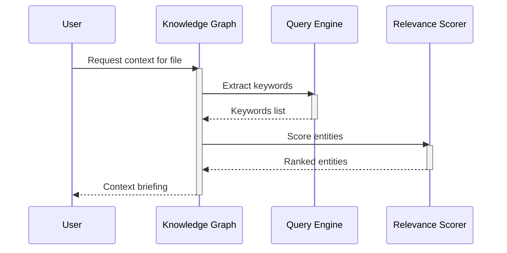
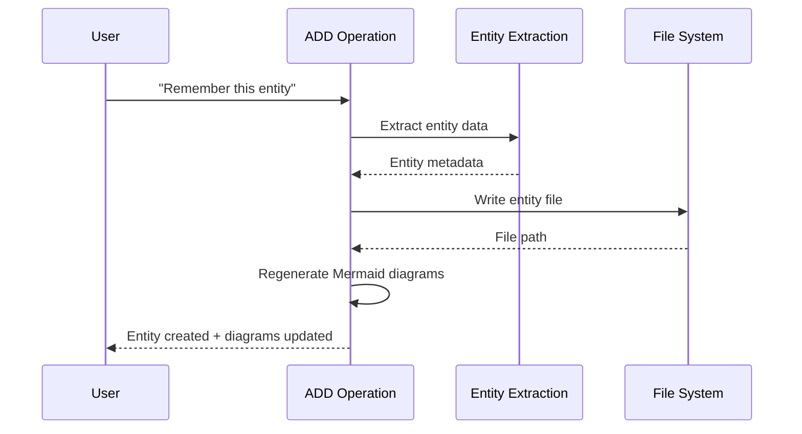
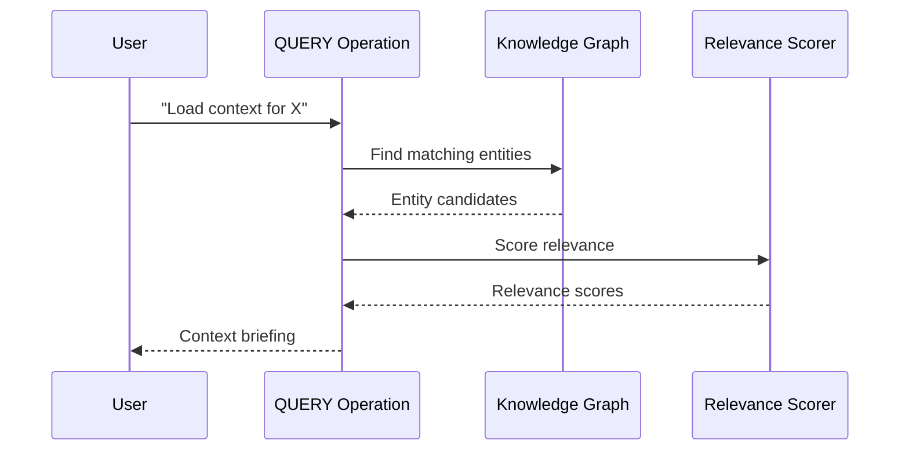
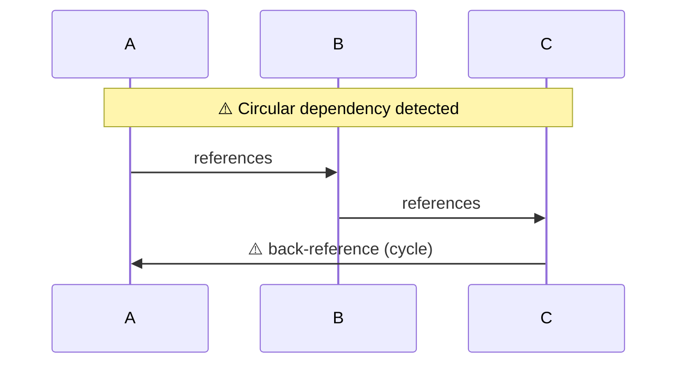
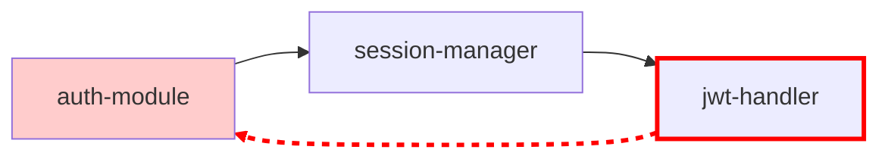

# Entity Interactions Sequence Diagram Template

## Purpose

Generate a Mermaid sequence diagram showing interactions and message flows between entities.

## Template Structure



## Generation Rules

1. **Participants**: Each entity becomes a participant
2. **Participant naming**: Use `participant ID as Display Name` format
3. **Message types**:
   - Solid arrow (`->>`) for synchronous calls
   - Dashed arrow (`-->>`) for responses/callbacks
   - Dotted arrow (`--x`) for failed/error messages
4. **Activation boxes**: Use `+` and `-` to show activation

## Syntax Validation Checklist

- [ ] No list syntax conflicts
- [ ] Participant names use valid identifiers (no spaces in IDs)
- [ ] Messages use proper arrow syntax (`->>`, `-->>`, `--x`)
- [ ] No emoji in participant names or messages
- [ ] Proper activation/deactivation pairing (`+`/`-`)

## Example Output



## Interaction Patterns

### ADD Operation Flow



### QUERY Operation Flow



## Output File Location

Generated sequence diagrams should be written to:
`Memory/{project}/graph-sequence.md`

## Timestamp Format

Include generation timestamp as HTML comment:
`<!-- Generated: YYYY-MM-DD HH:MM:SS -->`

## Cycle Visualization

### When to Show Cycles

When QUERY detects circular references (A ↔ B), note them in the diagram.

### Sequence Diagram Token

For sequence diagrams, add a note when participants form a cycle:



### Relationship Graph (Better for Cycles)

For explicit cycle visualization, generate a **separate relationship graph** using `graph TD` or `graph LR`:



### Cycle Detection in Generation

When generating sequence diagrams from entity data:

1. Check for circular references in `related` fields
2. If cycle detected (A ↔ B or A → B → C → A):
   - Add `Note over A,B: ⚠️ Circular dependency`
   - Style flow arrows differently for cycle edges
   - Consider generating relationship graph alongside sequence diagram

### Code Example

```python
def detect_cycles(entities: List[Entity]) -> List[Tuple[str, str]]:
    cycles = []
    for entity in entities:
        for related in entity.related:
            related_entity = load_entity(related)
            if entity.name in related_entity.related:
                cycles.append((entity.name, related))
    return cycles

def add_cycle_indicators(mermaid_code: str, cycles: List[Tuple[str, str]]) -> str:
    for A, B in cycles:
        mermaid_code += f"\nNote over {A},{B}: Circular dependency"
    return mermaid_code
```

### Styling for Cycles

| Element            | Style                                  | Meaning                     |
| ------------------ | -------------------------------------- | --------------------------- |
| Cycle arrow        | `stroke:#ff0000,stroke-dasharray: 5 5` | Completion of cycle         |
| Cycle note         | `Note over` with ⚠️ emblem             | Warning indicator           |
| Cycle participants | `fill:#ffcccc`                         | Highlight involved entities |
