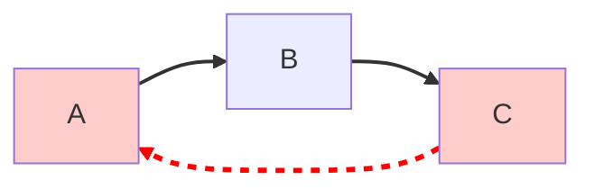
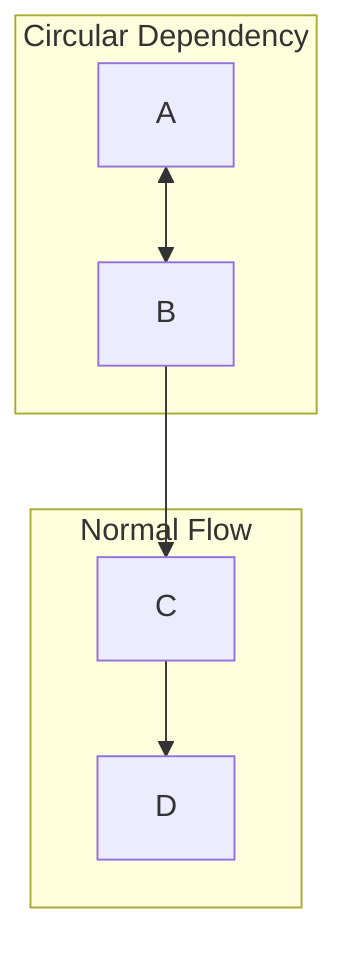

# Graph Relationships Template

Generate Mermaid relationship graphs (node-link diagrams) showing entity dependencies.

## When to Use

- Visualizing entity architecture and dependencies
- Showing circular references clearly
- High-level overview of knowledge graph structure
- Complement to sequence diagrams (static vs. dynamic)

## Diagram Types

### Top-Down Graph (`graph TD`)

```mermaid
graph TD
    %% Entities as nodes
    A[{project}.auth-module] --> B[{project}.session-manager]
    A --> C[{project}.jwt-handler]
    B --> D[{project}.user-model]
    C --> D

    %% Styling by importance
    style A fill:#2d3748,stroke:#4a5568,color:#fff
    style B fill:#2d3748,stroke:#4a5568,color:#fff
    style C fill:#718096,stroke:#4a5568,color:#fff

    %% Legend
    subgraph Legend
        H[High importance]
        M[Medium importance]
        L[Low importance]
    end
```

### Left-Right Graph (`graph LR`)

```mermaid
graph LR
    %% Alternative layout
    A[{project}.auth-module] --> B[{project}.session-manager]
    B --> C[{project}.jwt-handler]

    %% Class definitions for styling
    classDef high fill:#2d3748,stroke:#4a5568,color:#fff
    classDef medium fill:#718096,stroke:#4a5568,color:#fff

    class A,B high;
    class C medium;
```

## Generation Rules

### Node Naming

| Rule            | Valid                       | Invalid                        |
| --------------- | --------------------------- | ------------------------------ |
| Use ID          | `A[Display Name]`           | `Display Name` alone           |
| No spaces in ID | `authModule`                | `auth module`                  |
| No dots in ID   | `A`                         | `inference-api.auth-module`    |
| Link by ID      | `A --> B`                   | `A --> Display Name`           |
| Prefixed text   | `A[{project}.auth-module]`  | `[auth-module]` (no prefix)    |

### Styling by Category

```mermaid
graph TD
    %% Style by entity type
    classDef entity fill:#2d3748,stroke:#4a5568
    classDef concept fill:#2b6cb0,stroke:#2c5282
    classDef decision fill:#9c4221,stroke:#7b341e
    classDef process fill:#276749,stroke:#22543d

    %% Apply classes
    class auth,api entity
    class pattern,style concept
    class adr1,adr2 decision
    class workflow process
```

### Importance-Based Stizing

| Importance | Fill Color       | Stroke    | Usage           |
| ---------- | ---------------- | --------- | --------------- |
| High       | `#2d3748` (dark) | `#4a5568` | Current context |
| Medium     | `#718096`        | `#4a5568` | Related         |
| Low        | `#a0aec0`        | `#718096` | Distant         |

## Cycle Visualization

### Highlighting Circular References



### Cycle Detection Markup



## Output Structure

### Generated File: `{project}.graph-relationships.md`

```
<!-- Generated: YYYY-MM-DD HH:MM:SS -->

# {Project} Knowledge Graph - Relationships

## Architecture Overview

```mermaid
graph TD
    {generated nodes and edges}
```

## Component Dependencies

```mermaid
graph LR
    {filtered view: dependencies only}
```

## Entities by Relevance

```mermaid
graph TD
    {filtered view: color-coded by relevance score}
```

## Generated Diagrams

| View           | Description           |
| -------------- | --------------------- |
| Full           | All entities          |
| Context        | Current query context |
| High Relevance | Top 10 by score       |

## Integration with Sequence Diagrams

| Sequence Diagram   | Relationship Graph    |
| ------------------ | --------------------- |
| Shows interactions | Shows structure       |
| Temporal (when)    | Static (what)         |
| Message flows      | Dependencies          |
| Good for workflows | Good for architecture |

## Best Practices

1. **Generate both**: Sequence + Relationship for complete picture
2. **Filter large graphs**: Show top N entities by relevance
3. **Color code**: Importance or category for quick scanning
4. **Group related**: Use `subgraph` for modularity
5. **Cycle indicators**: Dashed red for circular refs

## Validation

Before generating, verify:

- [ ] All node IDs are valid (no spaces or dots — put `{project}.{name}` in display text)
- [ ] Edges use `-->` not arrows with spaces
- [ ] Class definitions come before usage
- [ ] No cycles unless intentional (documented)

## Mermaid Version Compatibility

**Important:** Different Mermaid versions support different `linkStyle` syntax.

| Syntax | Compatibility | Example                                       |
| ------ | ------------- | --------------------------------------------- |
| Simple | Mermaid 8.x+  | `linkStyle 0 stroke:#ff0000`                  |
| Full   | All versions  | `linkStyle 0 stroke:#ff0000,stroke-width:2px` |

**Recommendation:** Always use the **full attribute syntax** (with `stroke-width`) for maximum compatibility across all Mermaid versions.

**Before:**

```mermaid
linkStyle 0 stroke:#ff0000  # May fail in older versions
```

**After:**

```mermaid
linkStyle 0 stroke:#ff0000,stroke-width:2px  # Works in all versions
```
