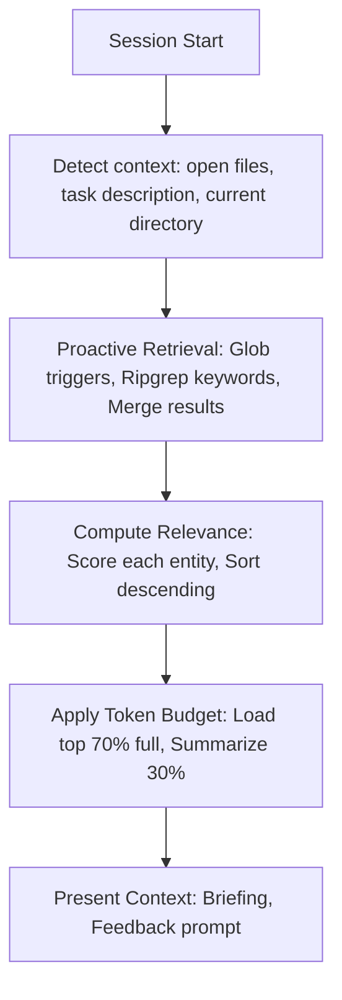
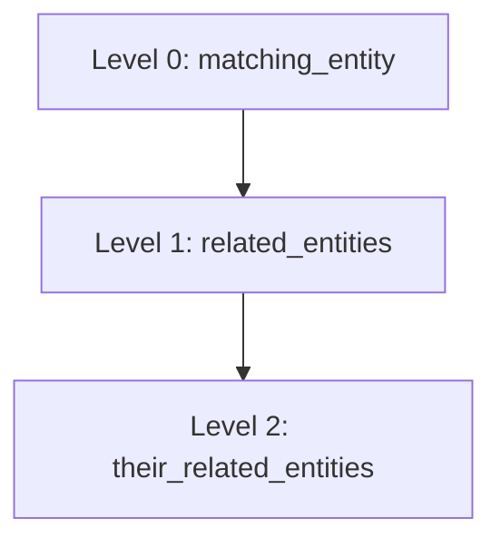

# QUERY Operation — Read from Knowledge Graph

## When to Use This Operation

- User says "load context for", "what do we know about", "check the graph"
- Agent starts work on a file that might have matching entities
- User asks about project architecture or entity relationships
- **AUTO-QUERY**: Triggered at session start (see Auto-Query section)

## When NOT to Use This Operation

- User wants to create/update entities (use ADD, UPDATE, or DELETE operation)
- Entity explicitly doesn't exist and user doesn't want to create it
- Information is available in current workspace (use Read directly)

## Critical Rules

### RULE 1: NO FABRICATION

> Only report information that exists in entity nodes. Quote verbatim, don't interpret.

### RULE 2: CITE SOURCES

> Always cite the entity document path when presenting information.

### RULE 3: STALE DETECTION

> Warn if entity references files that no longer exist.

### RULE 4: RESPECT TOKEN BUDGET

> Load context within budget. Prioritize high-relevance entities. Summarize overflow.

## Workflow

### Step 1: Resolve Paths

Resolve `{vault}` and `{project}`:

If ambiguous, enforce [Critical Rule 1](../../SKILL.md#rule-1-resolve-paths-once)

Set `{graph_path}` = `{vault}/memory/{project}/`

### Step 2: Identify Query Type

| Query Type      | Example                               | Action                                      |
| --------------- | ------------------------------------- | ------------------------------------------- |
| **File match**  | Agent working on `src/auth/service.py`| Find entities with matching trigger patterns|
| **Entity name** | "Load context for auth-module"        | Load specific entity by name                |
| **Search**      | "What entities relate to auth?"       | Grep for patterns                           |
| **Explore**     | "Show me the knowledge graph"         | Load index.md or list entities              |
| **Auto-query**  | Session start                         | Proactive context loading (see below)       |

### Step 3: Find Matching Entities

#### File Match (Auto-load)

```bash
Grep(pattern: "pattern:.*{file_path}", path: "{graph_path}", type: "md")
```

Or:

```
Glob(pattern: "{graph_path}/entities/*.md")
Read each → check triggers in agent-context block
```

#### Entity Name

```
Read("{graph_path}/entities/{entity-name}.md")
```

#### Search

```bash
Grep(pattern: "{search_term}", path: "{graph_path}", type: "md", -i: true)
```

#### Proactive Retrieval (Auto-Query)

For auto-query, use [keyword-extraction.md](../helpers/keyword-extraction.md) and [proactive-retrieval](#proactive-retrieval):

1. Extract keywords from current context (task, open files)
2. Run ripgrep search if available
3. Match results to entity triggers
4. Merge with glob-based results

### Step 4: Compute Relevance Scores

Use [relevance-scoring.md](../helpers/relevance-scoring.md):

For each matching entity:

1. Gather metadata: importance, usage
2. Compute `importance_weight` (high=1.0, medium=0.7, low=0.4)
3. Compute `recency_factor = 1 / (1 + days_since_last_used / 30)`
4. Compute `usage_factor = log(use_count + 1) / log(max_use_count + 1)`
5. Calculate `relevance = importance_weight × recency_factor × usage_factor`

### Step 5: Parse Entity Document

For each matching entity:

1. Extract frontmatter (between `---` delimiters)
2. Parse `agent-context` code block (YAML)
3. Extract wiki-links from `related` field

**Error handling:** If frontmatter is malformed (missing `---`, invalid YAML):

- Log: "Malformed frontmatter in [[{entity}]]: {error}"
- Skip parsing for this entity
- Continue with remaining entities
- Note in report: "Skipped {entity} — malformed frontmatter"

### Step 6: Traverse Related Entities

Use [graph-traversal.md](../helpers/graph-traversal.md):

1. For each wiki-link in `related`, load that entity
2. Default depth: 2 levels
3. Build a tree of related context
4. Compute relevance scores for traversed entities

### Step 7: Apply Token Budget

Use [token-budget.md](../helpers/token-budget.md):

1. Count tokens in all loaded entities
2. If total exceeds budget:
   - Sort entities by relevance (descending)
   - Load top 70% budget as full detail
   - Load remaining 30% budget as summaries
   - Omit overflow with count

### Step 8: Present Context Briefing

```markdown
### Context Briefing

**Loaded:** {count} entities ({tokens} tokens)
**Budget:** {budget} tokens
**Compression:** {compressed_count} summarized, {omitted_count} omitted

---

#### [[{entity-1}]] (relevance: 0.92)

**Type:** {type} | **Category:** {category} | **Importance:** {importance}
**Last updated:** {updated}

##### Constraints (MUST follow)
1. {constraint_1}
2. {constraint_2}

##### Patterns (SHOULD use)
**{pattern_name}:** {pattern_template}

##### Checks to Run After Changes
- {check_1}
- {check_2}

##### Related Entities
- [[{related-1}]] — {brief description}
- [[{related-2}]] — {brief description}

##### Implementation Files
- `{file_1}` — {description}
- `{file_2}` — {description}

---

#### [[{entity-2}]] (relevance: 0.78) — *Summary*

- Type: {type} ({category})
- Key constraint: {most_important_constraint}
- Related: [[{related-1}]],[[related-2}]]

---

*{omitted_count} lower-relevance entities omitted. Use "load full context for {name}" to see all.*
```

### Step 9: Stale Entity Check

For each implementation file listed:

1. Check if file exists: `Bash("test -f {file}")`
2. If not found:
   - Add to `health.stale_files`
   - Set `health.needs_update = true`
   - Warn: "⚠ [[{entity}]] may be stale: {file} not found"

**Error handling:** If `test -f` command fails (permissions, invalid path):

- Log: "Cannot check file existence: {error}"
- Mark file as "unknown status" rather than stale
- Warn: "⚠ Cannot verify [[{entity}]] implementation file"

### Step 10: Update Usage Metadata

For each entity loaded (full or summarized):

```yaml
usage:
  last_used: {today}
  use_count: {previous_count + 1}
```

Update entity file with new usage values.

## Auto-Query

Auto-query triggers at session start (skill initialization).

### Auto-Query Flow



### Skip/Disable Auto-Query

User can skip or disable:

- "Skip auto-query" — Skip this session
- "Disable auto-query" — Don't run in future sessions

Store preference in `{graph_path}/.auto-query-config`:

```yaml
auto_query:
  enabled: true|false
  last_skipped: {date}
```

## Proactive Retrieval

### Keyword Extraction

Use [keyword-extraction.md](../helpers/keyword-extraction.md):

1. **From triggers**: Extract path components (`src/auth/service.py` → `auth`, `service`)
2. **From tags**: Use entity tags directly
3. **From task**: Extract keywords from task description (if available)

### Ripgrep Search

If ripgrep available:

```bash
rg -l -i "keyword1|keyword2|keyword3" --type code {project_path}
```

Timeout: 5 seconds.

### Merge Results

1. Match ripgrep results to entity triggers
2. Merge with glob-based matches
3. Dedupe by entity name

## Graph Traversal

### Default Traversal (2 levels)



### Controlled Traversal

```
User: "Load context for auth-module with depth 3"
```

Traverse 3 levels deep, presenting all constraints and patterns.

## Missing Entity Handling

### Entity Not Found

```
No entity found matching: {query}

Would you like to:
1. Create a new entity
2. Search for similar entities
3. Continue without context
```

### Partial Match

```
No exact match for "{query}". Similar entities:
- [[auth-module]] — Authentication module
- [[auth-middleware]] — Request auth middleware

Select one or create new?
```

## Output Format

### Successful Load

```markdown
### QUERY Complete

**Matched:** {count} entities
**Traversed:** {levels} levels
**Related:** {related_count} entities loaded
**Tokens:** {tokens}/{budget}
**Compression:** {compressed} summarized, {omitted} omitted

---

{context_briefing_for_each_entity}

---

**Was this context helpful?** [Yes] [Partially] [No]
```

### No Match

```markdown
### QUERY Result: No Match

Searched for: {query}
Path: {graph_path}

Suggestions:
- Check if vault path is correct
- Create the entity with ADD/UPDATE/DELETE operation
- Try broader search terms
```

## Mermaid Visualization Offer

After presenting query results, offer to generate a Mermaid diagram:

```markdown
**Generate Mermaid diagram of these results?** [Yes] [No]
```

If user accepts:

1. Read [../mermaid/ops/ADD.md](../mermaid/ops/ADD.md) for generation workflow
2. Ask user which [template](../mermaid/templates) to use
3. Generate diagram and write to `{graph_path}/{query}-diagram.md`

## Best Practices

- Scope searches to relevant folders
- Parse frontmatter before reading full content
- For large graphs, use targeted grep instead of glob
- Always cite entity paths when presenting information
- Warn about stale entities but don't auto-fix (use ADD/UPDATE)
- Compute relevance before loading to prioritize
- Respect token budget to avoid context explosion

## Query Result Caching

### Purpose

Cache query results to avoid recomputing identical queries within a session.

### Cache Key

Cache key = hash of: query type + query term + depth + budget

```python
cache_key = f"{query_type}:{query_term}:{depth}:{budget}"
```

### Cache Storage

Store in session state (memory only, not persisted):

```python
query_cache: Dict[str, CachedResult] = {}

class CachedResult:
    entities: List[Entity]
    timestamp: datetime
    ttl_seconds: int = 300  # 5 minutes
```

### Cache Lookup

Before running QUERY workflow:

```python
def check_query_cache(query_params) -> Optional[CachedResult]:
    key = generate_cache_key(query_params)
    if key in query_cache:
        cached = query_cache[key]
        if (now() - cached.timestamp).seconds < cached.ttl_seconds:
            return cached.entities
        else:
            del query_cache[key]  # Expired
    return None
```

### Cache Population (After Step 10)

After computing final results:

```python
def cache_query_result(query_params, entities):
    key = generate_cache_key(query_params)
    query_cache[key] = CachedResult(
        entities=entities,
        timestamp=now()
        ttl_seconds=300
    )
    # Prune old entries if cache > 100 items
    if len(query_cache) > 100:
        oldest = min(query_cache.items(), key=lambda x: x[1].timestamp)
        del query_cache[oldest[0]]
```

### Cache Hit Reporting

If cache hit, indicate in results:

```markdown
### QUERY Complete (Cached)
**Cached:** Results from {cache_age} seconds ago
**Loaded:** {count} entities ({tokens} tokens)
```

### When to Cache

| Query Type  | Cacheable | TTL    |
| ----------- | --------- | ------ |
| Auto-query  | Yes       | 5 min  |
| File match  | Yes       | 2 min  |
| Entity name | Yes       | 10 min |
| Search      | Yes       | 5 min  |
| Explore     | No        | —      |

### When NOT to Cache

- **Health check queries**: Real-time stale detection
- **User override "fresh"**: Explicit "fresh" or "reload" in query
- **Budget change**: Different token budget = different results

---

## See Also

**Related Operations:**

- [ADD](./ADD.md) — Create new entities
- [UPDATE](./UPDATE.md) — Modify existing entities
- [DELETE](./DELETE.md) — Remove entities
- [RENAME](./RENAME.md) — Rename/move entities

**Related Assets:**

- [graph-traversal.md](../helpers/graph-traversal.md) — Traverse related entities
- [relevance-scoring.md](../helpers/relevance-scoring.md) — Compute relevance scores
- [token-budget.md](../helpers/token-budget.md) — Manage token budget
