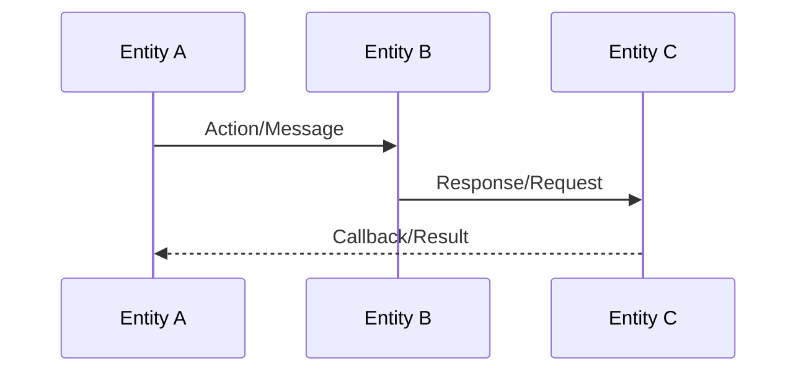
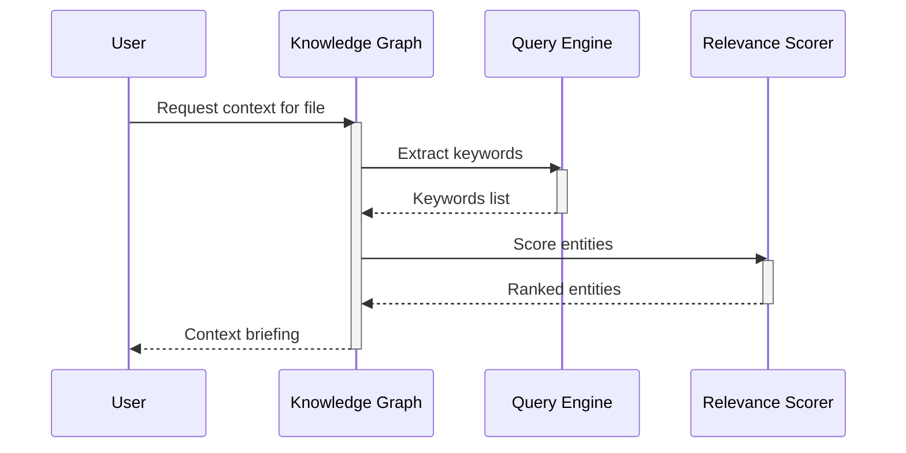
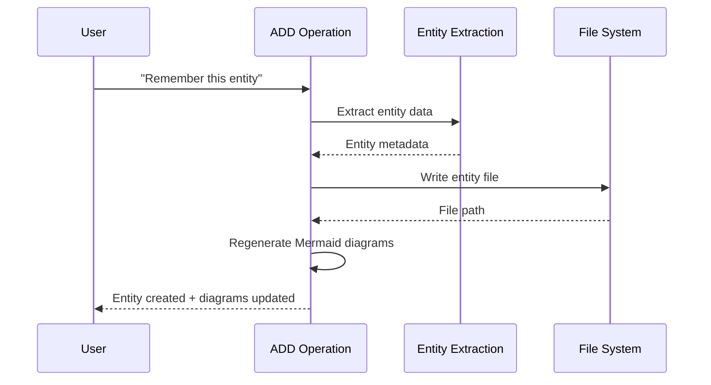
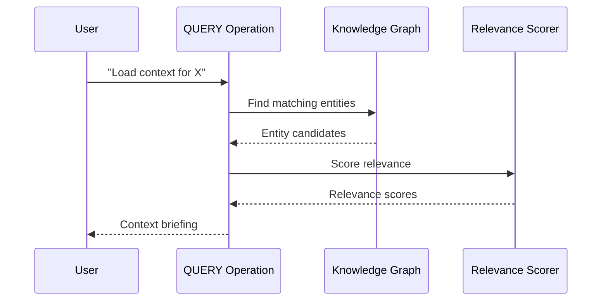

# Entity Interactions Sequence Diagram Template

## Purpose

Generate a Mermaid sequence diagram showing interactions and message flows between entities.

## Template Structure

## Generation Rules

1. **Participants**: Each entity becomes a participant
2. **Participant naming**: Use `participant ID as Display Name` format
3. **Message types**:
   - Solid arrow (`->>`) for synchronous calls
   - Dashed arrow (`-->>`) for responses/callbacks
   - Dotted arrow (`--x`) for failed/error messages
4. **Activation boxes**: Use `+` and `-` to show activation

## Syntax Validation Checklist

- [ ] No list syntax conflicts
- [ ] Participant names use valid identifiers (no spaces in IDs)
- [ ] Messages use proper arrow syntax (`->>`, `-->>`, `--x`)
- [ ] No emoji in participant names or messages
- [ ] Proper activation/deactivation pairing (`+`/`-`)

## Example Output

## Interaction Patterns

### ADD Operation Flow

### QUERY Operation Flow

## Output File Location

Generated sequence diagrams should be written to:
`Memory/{project}/{project}-sequence.md`

## Timestamp Format

Include generation timestamp as HTML comment:
`<!-- Generated: YYYY-MM-DD HH:MM:SS -->`
