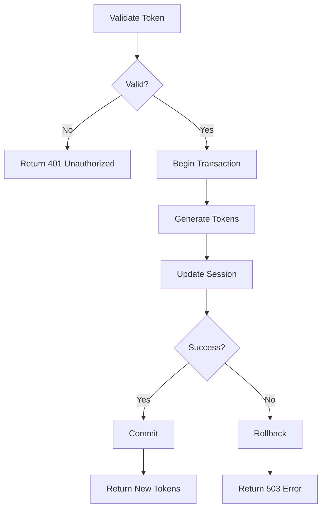

# Token Refresh Flow

Atomic token refresh with rollback on failure.

## Description

This process handles JWT token refresh while ensuring atomicity. If any step fails, the entire operation rolls back to prevent partial state.

## Steps

### Step 1: Validate Refresh Token

Check if the provided refresh token is valid and not expired.

- Input: `refresh_token` (string)
- Action: Verify signature, check expiration, verify not revoked
- Output: `session_id` (string) or validation error

### Step 2: Begin Transaction

Start Redis transaction for atomic update.

- Input: `session_id`
- Action: `redis.multi()` to begin transaction
- Output: Transaction handle

### Step 3: Generate New Tokens

Create new access and refresh tokens.

- Input: `session_id`, `user_id`
- Action: `jwt.rotate(refresh_token)` to generate new pair
- Output: `new_access_token`, `new_refresh_token`

### Step 4: Update Session

Store new tokens in Redis.

- Input: `session_id`, new tokens
- Action: `tx.set(session_key, token_data)`
- Output: Transaction ready for commit

### Step 5: Commit or Rollback

Execute transaction or discard on error.

- Input: Transaction handle
- Action: `tx.exec()` or `tx.discard()`
- Output: New tokens or error

## Flow Diagram



## Agent Context

```agent-context
triggers:
  - pattern: "*token*"
  - pattern: "*refresh*"
  - pattern: "*auth*"
constraints:
  - "Token refresh must be atomic"
  - "Always use transaction (multi/exec)"
  - "Discard transaction on any error"
patterns:
  - name: "atomic-token-refresh"
    template: |
      async def refresh_tokens(refresh_token: str) -> TokenPair:
          async with redis.pipeline() as pipe:
              try:
                  result = await jwt.rotate(refresh_token)
                  await pipe.set(f"session:{result.session_id}", result.json())
                  await pipe.execute()
                  return result
              except Exception as e:
                  await pipe.reset()
                  raise RefreshError(str(e))
```

## Error Handling

| Error              | Handling                             |
| ------------------ | ------------------------------------ |
| Invalid token      | Return 401 Unauthorized              |
| Token expired      | Return 401 with "token_expired" code |
| Redis error        | Rollback transaction, return 503     |
| Concurrent refresh | Use lock, return 429                 |

## Related Entities

- [[auth-module]] — Orchestrates this flow
- [[jwt-handler]] — Token generation
- [[session-manager]] — Session storage

## Referencias

**Triggered by:** [[auth-endpoints]]
**Produces:** TokenPair
