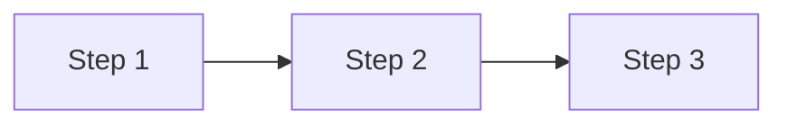

# {Process Name}

{One-line description of what this process does.}

## Description

{Detailed description: purpose, when it runs, who/what triggers it.}

## Steps

### Step 1: {Step Name}

{Description of this step}

- Input: {what comes in}
- Action: {what happens}
- Output: {what comes out}

### Step 2: {Step Name}

{Description}

- Input: {what comes in}
- Action: {what happens}
- Output: {what comes out}

### Step N: {Final Step}

{Description}

## Flow Diagram



## Agent Context

```agent-context
triggers:
  - pattern: "*{keyword}*"
constraints:
  - "{Constraint for this process}"
patterns:
  - name: "{pattern-name}"
    template: |
      {Code pattern for this process}
```

## Error Handling

| Error     | Handling        |
| --------- | --------------- |
| {Error 1} | {How to handle} |
| {Error 2} | {How to handle} |

## Related Entities

- [[involved-entity]] — Entity involved in this process
- [[related-process]] — Related process

## Referencias

**Triggered by:** [[trigger-entity]]
**Produces:** [[output-entity]]
