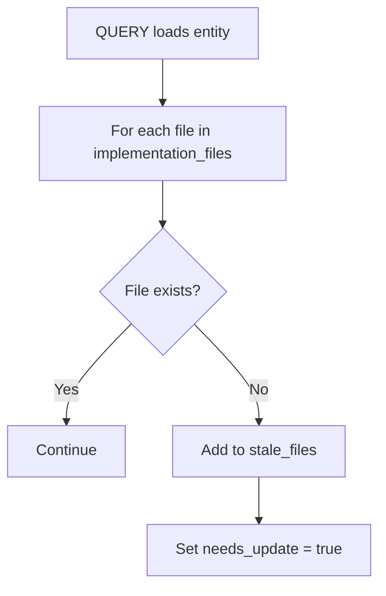
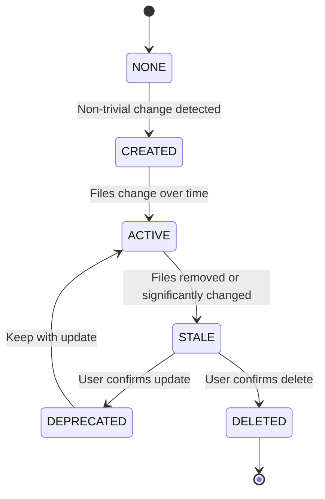

# Lifecycle Management Helper

## Purpose

Detect stale entities, track health status, and manage entity lifecycle (UPDATE/DELETE).

## Health Metadata Schema

```yaml
health:
  stale_files: [] # List of implementation files that no longer exist
  last_verified: null # Date of last health verification
  needs_update: false # Flag: entity content may be outdated
  needs_delete: false # Flag: entity should be considered for removal
```

## Stale Detection

### Detection Timing

Stale detection runs **on QUERY**, not continuously.

- **Lazy evaluation:** Only check entities being loaded
- **Non-blocking:** Flag issues but don't interrupt workflow
- **Actionable:** Surface in ADD/UPDATE/DELETE with concrete suggestions

### Detection Algorithm

```
For each entity loaded in QUERY:
    For each file in implementation_files:
        If not file.exists():
            Add file to health.stale_files
            Set health.needs_update = true
            Update health.last_verified = today
```

### Stale Detection Flow



### Example Output

```markdown
⚠ **Stale Entity Detected**

Entity: [[auth-service]]
Missing files:
 - `src/auth/legacy_handler.py` (deleted)
 - `src/utils/deprecated_util.py` (moved)

Options:
 [UPDATE] — Review and update entity
 [DELETE] — Remove entity
 [Dismiss] — Ignore for now
```

## Entity States



## UPDATE Flow

### Trigger

- Entity already exists during ADD operation
- User selects "UPDATE" from stale warning
- User manually requests update

### UPDATE Process

```
1. Load existing entity
2. Extract new metadata from current code
3. Show diff between old and new:
   - Frontmatter changes
   - Content changes
   - Trigger pattern changes
4. Prompt for confirmation:
   [MERGE] — Keep both, prefer new
   [OVERRIDE] — Replace all with new
   [CANCEL] — Keep existing
5. On confirmation:
   - Update entity document
   - Increment changelog version
   - Clear health.stale_files
   - Set health.needs_update = false
   - Update `updated` date
```

### Diff Format

```markdown
### Entity Update: auth-service

**Changes detected:**

#### Frontmatter
- `importance`: high → medium
- `tags`: [+rate-limit] [-legacy-auth]

#### Content
- Description: 2 lines changed
- Agent Context: triggers updated

#### Health
- Stale files: 2 cleared

[MERGE] [OVERRIDE] [CANCEL]
```

## DELETE Flow

### Trigger

- User selects "DELETE" from stale warning
- User manually requests deletion
- Entity flagged with `needs_delete = true`

### DELETE Process

```
1. Show confirmation prompt:
   "Delete 'auth-service'?"
   "This will remove the entity and its bidirectional references."

2. On confirmation:
   a. Load entity to get related entities
   b. For each related entity:
      - Remove wiki-link to deleted entity
      - Update related entity file
   c. Delete entity file
   d. Report results
```

### Confirmation Prompt

```markdown
### Delete Entity: auth-service

**Warning:** This action cannot be undone.

Entity will be removed along with:
 - Bidirectional reference from [[session-manager]]
 - Bidirectional reference from [[jwt-handler]]

[Confirm] [Cancel]
```

### Result Report

```markdown
### DELETE Complete

**Deleted:** auth-service
**File removed:** `Memory/project/entities/auth-service.md`

**References cleaned:**
 - [[session-manager]] — removed reference
 - [[jwt-handler]] — removed reference

**Orphaned entities:** None
```

## Health Check Command

### Trigger

- User says "check knowledge graph health" or similar
- Periodic reminder (optional, configurable)

### Health Check Process

```
1. Scan all entity files in {graph_path}/entities/
2. For each entity:
   a. Check implementation files existence
   b. Check usage.last_used for staleness
   c. Check health flags (needs_update, needs_delete)
3. Aggregate results
4. Present findings with batch operations
```

### Health Check Output

```markdown
### Health Check Results

**Total entities:** 45
**Healthy:** 38
**Issues found:** 7

#### Entities Needing Attention

| Entity             | Issue       | Details                 |
| ------------------ | ----------- | ----------------------- |
| [[auth-service]]   | Stale files | 2 files missing         |
| [[old-module]]     | Unused      | Not used in 45 days     |
| [[deprecated-api]] | Flagged     | needs_delete = true     |
| [[payment-v1]]     | Deprecated  | status = deprecated     |
| [[legacy-handler]] | Stale       | Not verified in 60 days |

#### Batch Operations
[Review Each] [Batch Update Stale] [Batch Delete Unused] [Dismiss]
```

## Stale Thresholds

| Threshold | Days  | Action                  |
| --------- | ----- | ----------------------- |
| Recent    | 0-30  | Normal use              |
| Aging     | 31-60 | Monitor, no warning     |
| Stale     | 61-90 | Suggest verification    |
| Unused    | 90+   | Flag for cleanup review |

## Integration Points

### QUERY Operation

After loading entities:

```python
for entity in loaded_entities:
    health_check = check_entity_health(entity)
    if health_check.stale_files:
        present_stale_warning(entity, health_check)
    if health_check.needs_delete:
        suggest_deletion(entity)
```

### ADD/UPDATE/DELETE Operations

Before creating entity:

```python
if entity_exists(entity_name):
    offer_update_or_delete(entity_name, existing_entity, new_content)
```

### Session Start

Optional health summary:

```python
if config.show_health_summary:
    issues = quick_health_scan()
    if issues:
        present_summary(issues)
```

## Configuration

| Parameter               | Default | Description                          |
| ----------------------- | ------- | ------------------------------------ |
| `stale_days_threshold`  | 30      | Days before suggesting verification  |
| `unused_days_threshold` | 90      | Days before flagging for cleanup     |
| `verify_on_query`       | true    | Check health when entity is loaded   |
| `batch_size`            | 10      | Max entities to show in health check |

## Bases Integration

### Computed Lifecycle State

The `graph.base` dashboard computes entity lifecycle state dynamically using the `lifecycle_state` formula:

```yaml
lifecycle_state: |
  if(health.needs_delete, "DEPRECATED",
    if(health.needs_update || health.stale_files.length > 0, "STALE",
      if(!usage.last_used || usage.use_count == 0, "CREATED",
        if((now() - date(usage.last_used)).days > 90, "STALE", "ACTIVE"))))
```

### State Transitions

| State      | Entry Condition                                       | Exit Condition           | Action in Bases                 |
| ---------- | ----------------------------------------------------- | ------------------------ | ------------------------------- |
| NONE       | New entity                                            | Always passes to CREATED | (Internal, not displayed)       |
| CREATED    | Entity exists, never used                             | First QUERY or UPDATE    | Show as "New"                   |
| ACTIVE     | Recently used (within 90 days)                        | 90+ days unused          | Show as "Active"                |
| STALE      | Files missing OR needs_update flag OR 90+ days unused | User verifies entity     | Show "🔄 Update" or "⏰ Verify" |
| DEPRECATED | needs_delete flag set                                 | Entity deleted           | Show "⚠️ Delete"                |
| DELETED    | Entity file removed                                   | —                        | Removed from base               |

## Best Practices

1. **Don't auto-delete:** Always require user confirmation
2. **Preserve references:** Clean bidirectional links on DELETE
3. **Lazy evaluation:** Only check health when needed
4. **Clear warnings:** Show exactly what's wrong and how to fix it
5. **Batch operations:** Allow bulk updates for efficiency
