# Mermaid ADD Operation

Create Mermaid sequence diagram files for knowledge graph projects.

## Trigger

- First entity creation in a new project (called from [ADD operation](../../ops/ADD.md) Step 11)
- Explicit "create mermaid" or "generate diagram" command
- User requests visualization of project structure

## Prerequisites

- Entity directory structure exists at `Memory/{project}/`
- Templates available at [templates](../templates/)

## Workflow

### Step 1: Resolve Paths

```
vault = resolved vault path
project = resolved project name
graph_path = {vault}/Memory/{project}
```

### Step 2: Collect Entity Data

Scan all entity folders:

```
{graph_path}/entities/*.md
{graph_path}/concepts/*.md
{graph_path}/decisions/*.md
{graph_path}/constraints/*.md
{graph_path}/processes/*.md
```

For each entity, extract:

- Name (from filename or frontmatter `name`)
- Type (from folder name)
- Related entities (from frontmatter `related`)
- Description (first paragraph or frontmatter `summary`)

### Step 3: Generate Sequence Diagram

Use template: `knowledge-graph/assets/mermaid/templates/entity-interactions.md`

Structure:

```
sequenceDiagram
    participant A as Entity A
    participant B as Entity B
    A->>B: Operation
```

Focus on operation flows: ADD → Entity Extraction → File Write → Regeneration.

Output to: `{graph_path}/graph-sequence.md`

### Step 4: Generate Relationship Graph

Use template: `knowledge-graph/assets/mermaid/templates/graph-relationships.md`

Structure: `graph TD` or `graph LR` with nodes and edges from entity `related` field:

```mermaid
graph TD
    A[auth-module] --> B[session-manager]
    B --> C[jwt-handler]
    style A fill:#2d3748
```



Output to: `{graph_path}/graph-relationships.md`

### Step 4: Validate Syntax

Before writing, validate Mermaid syntax:

1. **No list syntax conflicts**: Check for `[N. Item]` patterns
2. **REQUIRED participant prefix**: Every line with `as "Name"` MUST start with `participant` or `actor`
   - **FAIL:** `API as MOEPP API` has no keyword!
   - **PASS:** `participant API as MOEPP API`
3. **Valid arrow syntax**: Use `->>`, `-->>`, `--x`
4. **No emoji**: Replace with text labels

**Auto-validation code (run before write):**

```python
# Check for missing participant keywords
for line in mermaid_code.split('\\n'):
    if ' as "' in line and not line.strip().startswith('participant') and '->>' not in line and '-->>' not in line:
        raise ValidationError(f"Missing 'participant': {line}")
```

### Step 5: Write with Timestamp

Each output file MUST include:

```
<!-- Generated: YYYY-MM-DD HH:MM:SS -->
{mermaid code}
```

### Step 6: Report Results

```
✓ Created graph-sequence.md (interaction diagram)
```

Or if skipped:

```
(Diagram skipped — {reason})
```

## Template Content

### graph-sequence.md

Per-project sequence diagram with:

- **Participants**: All entities by type
- **Interactions**: Related entity connections
- **Flows**: ADD, UPDATE, DELETE operation flows

## Human Customization

- Humans can customize mermaid files (add participants, change styling)
- Skill prompts before overwriting: "Update graph-sequence.md?"
- Custom `.md` diagram files (not `graph-sequence.md`) are never touched by skill

## Exclusion from Entity Operations

The `graph-sequence.md` file is NOT part of the knowledge graph:

- Not scanned by QUERY operation
- Not affected by entity lifecycle
- Not included in entity counts
- Treated as a view, not data

## Error Handling

- **Template not found**: Error, cannot proceed
- **Write failed**: Error with path details

## Cycle Visualization Support

When generating diagrams from entities with circular references:

1. Detect cycles: Check if A→B and B→A exist in entity `related` fields
2. Add visual indicators:
   - `Note over` participants with ⚠️ Circular dependency
   - Dashed red arrows for cycle edges
3. Reference: [Cycle Visualization](../templates/entity-interactions.md)
